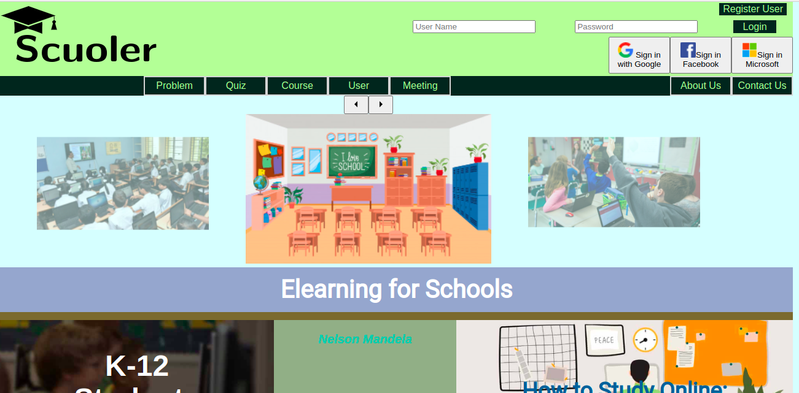

# Scuoler CSharp Script Executor

## Description

Scuoler (https://scuoler.com/) is a Learning/Content Management System (LMS). This dotnet core program can be used to dynamically compile and run
a CSharp script string passed as an argument to this program.

The parent repository (https://github.com/MathewJoseph31/scuoler) contains the code for the original Scuoler App (https://scuoler.com/).

Philsophy

At Scuoler, we are thoroughly passionate about innovative ideas and their implementations. We are currently engrossed in the development and promotion of our LMS product, Scuoler. We are committed to spread positive vibes and cutting edge constributions in advancements on software technology and science. If you like our team or philosophy, do contact us by writing to us at (https://scuoler.com/contactUs), and we ensure numerous opportunities towards fruitful collaborations.

## Table of Contents

- [Technologies Utilized](#Technologies)
- [Screenshot](#Screen)
- [Deployed Application](#Deployed)
- [License](#MIT)
- [Contact](#Contact)

## Technologies Utilized

- [Microsoft Dotnet Core 8.0](https://learn.microsoft.com/en-us/dotnet/core/whats-new/dotnet-8/runtime)
- [Nuget Package Microsoft.CodeAnalysis.CSharp](https://www.nuget.org/packages/Microsoft.CodeAnalysis.CSharp/)
- [Posgresql](https://www.postgresql.org/)
- [Heroku](https://www.heroku.com)
- [NPM Stripe Package](https://www.npmjs.com/package/stripe)
- [Node.js](https://nodejs.org/en/)
- [NPM nodemon Package](https://www.npmjs.com/package/nodemon)

## Screenshot

## Deployed Application

https://scuoler.com/

## MIT License

&copy;2024 Mathew Joseph

Permission is hereby granted, free of charge, to any person obtaining a copy
of this software and associated documentation files (the "Software"), to deal
in the Software without restriction, including without limitation the rights
to use, copy, modify, merge, publish, distribute, sublicense, and/or sell
copies of the Software, and to permit persons to whom the Software is
furnished to do so, subject to the following conditions:

The above copyright notice and this permission notice shall be included in all
copies or substantial portions of the Software.

THE SOFTWARE IS PROVIDED "AS IS", WITHOUT WARRANTY OF ANY KIND, EXPRESS OR
IMPLIED, INCLUDING BUT NOT LIMITED TO THE WARRANTIES OF MERCHANTABILITY,
FITNESS FOR A PARTICULAR PURPOSE AND NONINFRINGEMENT. IN NO EVENT SHALL THE
AUTHORS OR COPYRIGHT HOLDERS BE LIABLE FOR ANY CLAIM, DAMAGES OR OTHER
LIABILITY, WHETHER IN AN ACTION OF CONTRACT, TORT OR OTHERWISE, ARISING FROM,
OUT OF OR IN CONNECTION WITH THE SOFTWARE OR THE USE OR OTHER DEALINGS IN THE
SOFTWARE.

## Contact

For inquiries, please contact [Mathew Joseph](https://scuoler.com/contactUs)
or email me [Mathew Joseph](mailto:mathew@scuoler.com).
